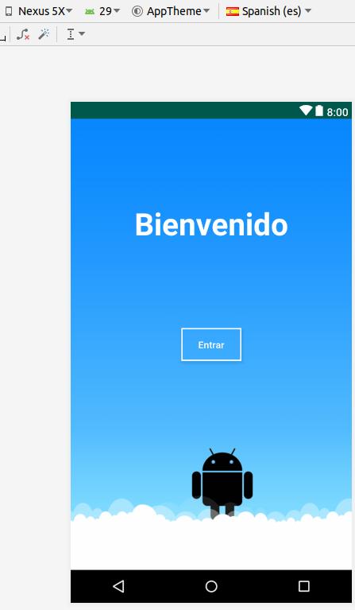
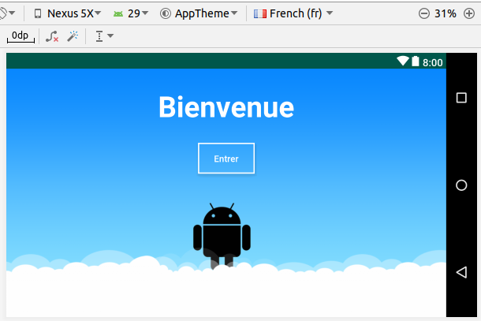
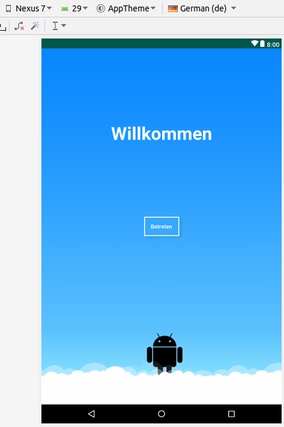
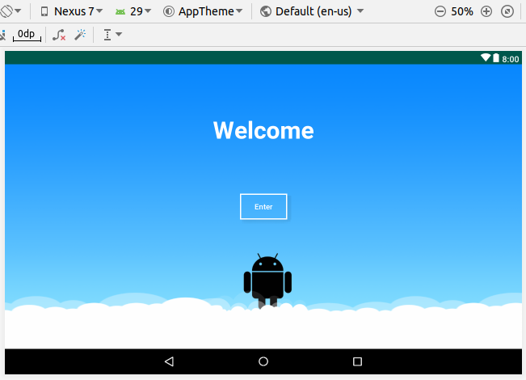
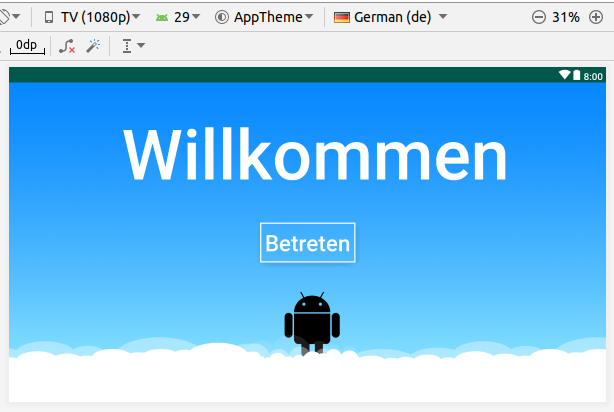

# Mi-primer-proyecto-Android
Primer assignment curso Coursera Fundamentos de Android

https://www.coursera.org/learn/fundamentos

## Objetivos
Crear una aplicación Android con las siguientes características:
  - Soporte a 3 idiomas
  - Generación imagen de fondo nine-patch
  - Correcta visulización imagen nine-patch, redimensionando sin deformar contenido marcado como "no deformable".
  - Soporte para diferentes orientaciones
  - Soporte para diferentes tamaños de pantalla
  - Interfaz de usuario correctamente distribuida en diferentes tamaños y orientaciones de pantalla

## Capturas de pantalla
### Nexus 5X - vertical - spanish

### Nexus 5X - horizontal - french

### Nexus 7 (tablet) - vertical - german

### Nexus 7 (tablet) - horizontal - english

### SmartTV (1080p) - german

